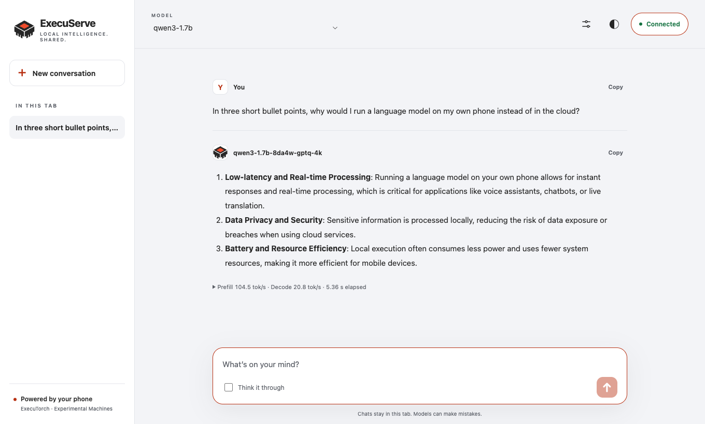

<div align="center">

<picture>
  <source media="(prefers-color-scheme: dark)" srcset="docs/brand/lockup-dark.svg">
  
</picture>

**ExecuTorch models, served from your phone.**<br>
An OpenAI- and Anthropic-compatible server for compiled `.pte` models, running in the background on Android.

[](https://experimentalmachines.org/execuserve/)
[](https://github.com/ExperimentalMachines/execuserve/actions/workflows/ci.yml)
[](LICENSE)
[](#requirements)
[](#http-api)
[](https://github.com/pytorch/executorch)
[](#architecture)

</div>

> [!NOTE]
> An independent project by [Experimental Machines](https://experimentalmachines.org). Not
> affiliated with, endorsed by or sponsored by the PyTorch Foundation or Meta. It runs models
> through ExecuTorch; it does not use or modify their logos.

ExecuServe keeps compiled [ExecuTorch](https://pytorch.org/executorch/) models loaded on an
Android phone and answers the OpenAI and Anthropic APIs over HTTP, for any app on the phone
or, if you allow it, on your network. A native console manages the server, and a small
browser chat ships inside it, so a laptop or tablet can talk to the phone's models with
nothing installed.

llama.cpp has `llama-server` for GGUF files. Nothing equivalent existed for `.pte` exports,
which on current phones are the fast path: on a Snapdragon 8 Elite the XNNPACK export decodes
1.2 to 1.6 times faster than llama.cpp (measured in
[OpenWeights](https://github.com/ExperimentalMachines/openweights)). ExecuServe is built on
OpenWeights' ExecuTorch engine and its chat templates, which are tested byte for byte against
each model family's own.

<div align="center">



<sub>The browser chat, served by the phone and answering from a model running on it.</sub>

</div>

## Contents

- [What makes it different](#what-makes-it-different)
- [Quick start](#quick-start)
- [HTTP API](#http-api)
- [Clients](#clients)
- [Browser chat](#browser-chat)
- [Several models on one phone](#several-models-on-one-phone)
- [Getting a model onto the phone](#getting-a-model-onto-the-phone)
- [The host CLI](#the-host-cli)
- [How it behaves](#how-it-behaves)
- [The console](#the-console)
- [Security](#security)
- [Requirements](#requirements)
- [Build and verify](#build-and-verify)
- [Architecture](#architecture)
- [Documentation map](#documentation-map)
- [Status and what comes next](#status-and-what-comes-next)
- [Contributing and contact](#contributing-and-contact)
- [License](#license)

## What makes it different

**A server, not a chat app.** Other on-device apps put a chat screen in front of a model.
ExecuServe puts an HTTP API in front of it, so the agents, SDKs and tools you already use can
call a model on your phone the way they call a cloud.

**Two APIs, checked with their own SDKs.** OpenAI's Chat Completions, Completions and
Responses, and Anthropic's Messages, with their error shapes and streaming framing. On the
minified release build on a phone, the official OpenAI SDK suite passes 16 of 16, the
Anthropic suite 8 of 8, and an edge-case probe 28 of 28.

**The KV cache belongs to the server.** Clients resend the whole conversation, as both APIs
expect; the server keeps the runtime's cache and remembers the exact bytes it holds for each
reply, so follow-ups and tool loops still hit. A warm second turn of a 2,000-token
conversation answered in 0.47 s instead of 8.4 s.

**Several models, one phone.** Keep up to three resident, each with its own cache and its own
endpoints, sharing one compute lane so they never halve each other's speed.

**Built to stay up.** A `specialUse` foreground service with the right locks, tested through
forced deep Doze with the screen off and a 10-minute soak on battery that answered 20 of 20.
Where an OEM ROM can still kill it, the console names what to allow.

**Locked down by default.** A key on every request, loopback included; a `Host` check against
DNS rebinding; a strict Content-Security-Policy on the browser chat; nothing in backups or
device transfers.

**A multiplatform core.** Everything except the runtime binding and the app shell is Kotlin
Multiplatform and compiles for iOS on every build.

## Quick start

You need an arm64 Android phone on Android 12 or later, `adb` on your computer, and an
ExecuTorch `.pte` export with its tokenizer (the app can also download one). Install the app
(see [Build and verify](#build-and-verify)), then:

```sh
tools/execuserve --model ~/models/Qwen3-1.7B-8da4w-gptq-2k.pte --port 8080
export OPENAI_BASE_URL=http://127.0.0.1:8080/v1
export OPENAI_API_KEY=$(cat ~/.config/execuserve/<device-serial>.key)
```

```python
from openai import OpenAI

client = OpenAI()  # reads the two variables above
reply = client.chat.completions.create(
    model="qwen3-1.7b",
    messages=[{"role": "user", "content": "Hello"}],
)
```

The script pushes the model and its tokenizer, starts the server, forwards the port over
adb, loads the model, and prints the base URL and the key.

## HTTP API

| Endpoint | What it does |
|---|---|
| `POST /v1/chat/completions` | Streaming, `stream_options.include_usage`, tools and tool calls, `reasoning_content`, opt-in `return_progress` |
| `POST /v1/responses` | String or item input, function-call items, typed stream events, `previous_response_id` with `store` |
| `POST /v1/messages` | Anthropic's Messages API: system, `tool_use` / `tool_result`, thinking blocks, its stream events, `cache_read_input_tokens`; `x-api-key` or bearer |
| `POST /v1/completions` | A raw prompt, no template |
| `GET /v1/models`, `/v1/models/{id}` | Installed models, with `context_length`, `loaded`, `owned_by` (the lab) and `capabilities` |
| `POST /apply-template` | The exact prompt a chat request renders to, without running it (llama.cpp's name) |
| `GET /metrics` | Prometheus text: `execuserve_` counters, gauges, time to first token and request quantiles |
| `GET /v1/execuserve/runs` | The caller's own run history as JSON with per-model summaries, or `?format=csv` |
| `GET /v1/execuserve/status` | The lane, the queue, resident models, threads, the caller's recent requests; another key's running request shows its progress but not who sent it |
| `POST /v1/execuserve/models/{id}/load` · `/unload` | Explicit residency |
| `GET /health` | No key needed |

The model, inference, status and residency routes are also served under `/models/{id}/`,
scoped to one model ([below](#several-models-on-one-phone)); `/metrics` and the run history
stay server-wide.

| Parameters | |
|---|---|
| Honoured | `max_tokens` / `max_completion_tokens` / `max_output_tokens`, `temperature`, `stop`, function `tools`, `tool_choice` `auto` / `none` |
| Accepted and ignored | `top_p`, penalties, `seed`, `logit_bias`, `user`, `include`: the runtime's sampler has only a temperature. Each response names what it ignored in `x-execuserve-ignored`; non-function tools (hosted `web_search`, MCP `namespace` groups, custom tools) are dropped and named there too |
| Refused with a 400 naming the parameter | `n > 1`, `logprobs`, forced tool choice (`required`, a named function, Anthropic's `any` / `tool`), JSON-schema output, images and audio. Each needs the runtime to constrain or expose sampling, which ExecuTorch's LLM runner does not |

- **Reasoning.** Qwen3 and SmolLM3 reason by default, as their templates do. Turn it off per
  request with `chat_template_kwargs: {"enable_thinking": false}`, `reasoning_effort: "none"`
  (Chat Completions) or `reasoning: {"effort": "minimal"}` (Responses), or for every request
  in Settings. It comes back as `reasoning_content`, or as a `reasoning` output item.
- **Stored responses.** `store` defaults to true, as on OpenAI. Stored in memory only, per
  key: at most 64 responses, 4 MiB and an hour. Anything else is a 400
  `previous_response_not_found`, never a silent fresh start.
- **Extensions.** `usage.prompt_tokens_details.cached_tokens` reports what the cache saved;
  `timings` gives queue, load, prefill and decode in llama.cpp's vocabulary; with
  `return_progress: true` a stream reports `prompt_progress` while a long prompt is read.

## Clients

Anything that takes an OpenAI base URL and a key.

| Client | Setting |
|---|---|
| OpenAI SDKs, LangChain, Vercel AI SDK | `base_url` / `baseURL` `http://<phone>:8080/v1`, plus the key |
| Anthropic SDKs and agents built on them | `base_url` `http://<phone>:8080` (no `/v1`), the key as `api_key` |
| Open WebUI | Settings → Connections → OpenAI API, URL `http://<phone>:8080/v1` |
| codex CLI | A provider with `wire_api = "responses"` (below) |
| Another app on the same phone | `http://127.0.0.1:8080/v1`, with a network security config allowing loopback (below) |

```toml
[model_providers.execuserve]
name = "ExecuServe"
base_url = "http://127.0.0.1:8080/v1"
env_key = "EXECUSERVE_API_KEY"
wire_api = "responses"
```

Codex's instructions and tool schemas alone run to tens of thousands of tokens, more than a
2k or 8k phone export holds; such a request is refused with `context_length_exceeded`.

Android refuses plain HTTP from apps targeting API 28+ unless the client allows it. Point the
client app's `android:networkSecurityConfig` at:

```xml
<network-security-config>
    <domain-config cleartextTrafficPermitted="true">
        <domain includeSubdomains="false">127.0.0.1</domain>
    </domain-config>
</network-security-config>
```

## Browser chat

Open `http://127.0.0.1:8080/` on the phone, or choose **Your network** in Settings and open
the **Browser chat** address from another device on the same trusted network. Choose
**Connect**, enter a key, pick a model. Replies stream with a stop button, optional
reasoning, generation settings and per-reply metrics.

The client ships inside the server: no CDN, no separate host, no inference in the browser.
Keys and chats stay in the tab's memory and are gone on reload. Network mode is plain HTTP,
so use a trusted LAN or an authenticated tunnel such as Tailscale.

The console's Hosting tab offers **Copy** and **Show QR** for every API URL, browser URL, key
and model ID. QR codes are generated on the phone; a key's QR needs **Reveal QR code** and hides after
a minute or when the app is backgrounded. URL QR codes never contain a key.

## Several models on one phone

In Settings → Hosting capacity, choose how many models to keep ready (one by default, up to
three), then load them from Hosting. Each keeps its own cache and gets scoped addresses:

- API: `http://<phone>:8080/models/<model-id>/v1`
- Browser: `http://<phone>:8080/models/<model-id>/`

Model IDs in paths are percent-encoded; clients still send the ID in the request, and a
request for another model on a scoped route is refused (`model_endpoint_mismatch`). The
unscoped `/v1` and root page keep serving every installed model. Scoped routes share keys,
limits and one compute queue: they are addresses, not separate security boundaries. Models
stay loaded together but run one request at a time; each resident model costs memory, and
memory pressure can evict them. Multiple resident models need automatic CPU threads with the
pinned runtime.

## Getting a model onto the phone

| Way | How |
|---|---|
| In the app | Library → **Browse the catalog** lists the XNNPACK exports published at [huggingface.co/experimentalmachines](https://huggingface.co/experimentalmachines). Downloads resume after a drop, are pinned to one repository commit, and are checked against the publisher's SHA-256 |
| From your computer | `tools/execuserve --model path/to/Model.pte` pushes it with its tokenizer and starts serving |
| Ask the phone to fetch it | `tools/execuserve pull <hf-repo> <file.pte>`: the phone downloads it itself, verified |
| By hand | `adb push Name.pte` and `Name.tokenizer.json` into `/sdcard/Android/data/org.experimentalmachines.execuserve/files/models/`. Push files, not folders: under Android 11+ storage a folder adb creates there belongs to the shell |

A `.pte` carries no tokenizer and no chat template, so both are named by the model's family.
Families with a template: Qwen3, Qwen3.5, Qwen2.5, Llama 3.2, SmolLM2, SmolLM3, Phi-4-mini,
Gemma 3, LFM2.5. Anything else is served on `/v1/completions` only.

## The host CLI

```
tools/execuserve --model qwen3-1.7b --port 8080      model already on the phone (id or alias)
tools/execuserve --model ~/Model.pte                  push it first
tools/execuserve --model qwen3-1.7b --network         reachable from the LAN too
tools/execuserve --model qwen3-1.7b --threads 4       CPU threads (0: ExecuTorch chooses)
tools/execuserve status | stop
tools/execuserve install app-release.apk             past ROMs that refuse `adb install`
tools/execuserve pull <hf-repo> <file.pte>            the phone downloads it, verified
tools/execuserve unrestrict                           Doze whitelist, appops, HyperOS autostart
  --serial <adb serial>   --key <secret>   --debug (the .debug build)   --no-forward
```

The CLI generates one key per device, stores it under `~/.config/execuserve/` readable only by
you, and hands it to the app through an intent only the adb shell may send: the service is
guarded by `android.permission.DUMP`, which the shell holds and ordinary apps cannot get.

## How it behaves

- **One compute lane.** ExecuTorch's LLM runner holds one sequence and one KV cache per
  loaded model and cannot batch, and a phone CPU runs one sequence well, so requests queue
  for a single lane. The queue is bounded (16 waiting, 4 per client by default): a client
  over its share gets `429`, a full server `503`, both with a `Retry-After` the SDKs honour.
  Timeouts, cancellations and disconnects, even while a prompt is still being read, stop the
  runtime within one prompt chunk.
- **Cache reuse is per key.** A Qwen3 tool loop's second request reused 174 of 205 prompt
  tokens on the POCO. Another key's request starts the cache over, so `cached_tokens` and the
  time to first token never tell one client what another asked.
- **CPU threads.** ExecuTorch picks the performance cores minus one; the setting overrides
  it. On the POCO, 4 threads decoded at 22 tokens a second against the default's 18, and
  8 threads read prompts at 199 against 184.
- **Every run is kept:** the figures, never the prompt, the reply or a key, for the last
  10,000 runs or 30 days. The Activity tab compares models on like-for-like runs and flags a
  run whose own timings disagree.
- **In the background.** Under forced deep Doze with the screen off, the emulator served a
  request over its network in 119 ms. On Xiaomi's HyperOS, Autostart decides whether Android
  may restart the server after its process dies; the console names it, and
  `tools/execuserve unrestrict` grants it over adb.
- **Heat and battery.** At thermal status `SEVERE` new requests get `503` with a retry time;
  at `CRITICAL` the running one is stopped. A battery floor can be set.

## The console

A console for the server, with a chat to try what it serves, in PyTorch's colours (paper,
ink and ember) and IBM Plex.

| Tab | What it shows |
|---|---|
| Hosting | Whether it is serving, the hosted models with their prefill and decode rates, the request being answered, **Connect** (this phone or your network, addresses, key, model IDs, Copy and QR), **Chat** on each hosted model, and anything that would stop it in the background |
| Library | Installed models with their lab's picture and source, downloads, and the catalog |
| Chat | A conversation with any installed model over the same local API your clients use: thinking on or off, prefill and decode rates per reply, Copy, and **Report this reply** |
| Activity | Every request across restarts, its phases and device state, a like-for-like comparison of models, the benchmark, CSV export |
| Settings | Connection, keys, hosting capacity, model defaults, CPU threads, background behaviour, limits |

Light, dark or system theme; every colour pair passes WCAG AA and APCA
(`tools/design/contrast.py`). The mark, the Block, is a chip package seen from above with an
ember die on its lid; `tools/design/mark.py` writes every copy of it, from the launcher icon
to the web chat, and the brand kit in [docs/brand](docs/brand).

## Security

- **A key on every request**, loopback included, because any app with network permission can
  reach `127.0.0.1`. Give each client its own key: the run log shows which one asked, and a
  key can be revoked alone. Keys are compared in constant time.
- **DNS rebinding** is stopped by a `Host` check: a request whose `Host` does not name this
  phone is refused.
- **The browser chat** is served with `default-src 'none'`, no inline script or style, no
  framing and no referrer; model output never enters `innerHTML`.
- **Nothing leaves in a backup:** backup and device-to-device transfer are both excluded.
- **Starting from another app** (`execuserve://start`) always asks the person holding the
  phone, and the dialog hides other apps' overlays so it cannot be tapjacked.
- **Network mode is plain HTTP:** on shared Wi-Fi a key can be read off the air. Across
  networks, use Tailscale; its address works as is, and a MagicDNS name once added in
  Settings.

To report a vulnerability, see [SECURITY.md](SECURITY.md).

## Requirements

- Android 12 (API 31) or newer, on a 64-bit Arm phone (`arm64-v8a`).
- An ExecuTorch `.pte` exported for XNNPACK, with the tokenizer it was exported with.
- Memory for the models you keep resident: each costs about its file size plus its window.
  The LFM2.5 exports are 761 MB (1.2B) and 1.7 GB (2.6B) at a 4k window.

## Build and verify

```sh
export JAVA_HOME=/path/to/jdk21
export ANDROID_HOME=/path/to/android-sdk

git clone https://github.com/ExperimentalMachines/execuserve.git
cd execuserve
./gradlew verify                        # lint, static analysis, every test tier, Android and iOS builds
./gradlew :android:app:assembleRelease  # the app (debug-signed until an upload key is configured)
```

| | |
|---|---|
| Toolchain | JDK 21 (compiling to Java 17), Android SDK platform 37, NDK 29 |
| Targets | minSdk 31, targetSdk 36, compileSdk 37, `arm64-v8a` only |
| Stack | Kotlin 2.3.21, Ktor 3.6 (CIO), kotlinx.coroutines and serialization, Jetpack Compose, DataStore, ExecuTorch 1.4 |
| Checks | `./gradlew verify` runs ktlint, detekt and Android lint, every JVM and Android host test, assembles the debug build and compiles the shared modules for iOS; every Kotlin warning fails the build |
| Without a phone | `./gradlew :jvm:devserver:installDist` builds the real server over a scripted model; `tools/compat/` holds the OpenAI, Anthropic and edge-case suites to run against it or a phone |
| On a phone | [docs/TESTING-ON-A-PHONE.md](docs/TESTING-ON-A-PHONE.md) |
| Release | `versionCode` is the commit count; `bundleRelease` needs the upload key ([docs/RELEASING.md](docs/RELEASING.md)) |

```sh
jvm/devserver/build/install/execuserve-dev/bin/execuserve-dev --port 8080 --key sk-dev
uv run --with openai python tools/compat/openai_sdk_check.py http://127.0.0.1:8080/v1 sk-dev
```

## Architecture

A multi-module Gradle project. `:shared:*` is Kotlin Multiplatform, compiled for Android, the
JVM and iOS; `:android:*` is how Android lets it run.

| Module | Responsibility |
|---|---|
| `:shared:api` | The OpenAI and Anthropic wire formats, errors and ExecuServe's status schema |
| `:shared:prompt` | Chat templates, the tool-call parser, stop markers, the reasoning split |
| `:shared:engine` | The runtime contract, sequence cache, compute lane, scheduler and residency |
| `:shared:catalog` | Model manifests, id resolution, Hugging Face export metadata |
| `:shared:server` | Ktor routes, auth, limits, SSE, error mapping, the embedded browser chat |
| `:shared:host` | Settings and their defaults, the server's lifecycle, what each state means |
| `:android:executorch` | The ExecuTorch binding |
| `:android:app` | The foreground service, the Compose console, downloads, run storage |
| `:jvm:testing`, `:jvm:devserver` | A scripted runtime, and the whole server on a laptop over it |

Why the line falls where it does, the one compute lane, the cache and its reply ledger,
backgrounding, exposure, every edge case and the design review log are in
[docs/ARCHITECTURE.md](docs/ARCHITECTURE.md).

## Documentation map

| Document | Read it for |
|---|---|
| [docs/ARCHITECTURE.md](docs/ARCHITECTURE.md) | The design, the HTTP API in full, edge cases, what was measured, and the review log |
| [docs/TESTING-ON-A-PHONE.md](docs/TESTING-ON-A-PHONE.md) | Testing on a physical phone, from installing past HyperOS to a screen-off soak |
| [docs/results/](docs/results/) | Measurements on real phones, with dates |
| [docs/brand/](docs/brand/) | The mark, lockups, Play assets and how to use them |
| [docs/RELEASING.md](docs/RELEASING.md) | Signing, version codes, and the Play release steps |
| [docs/privacy-policy.md](docs/privacy-policy.md) | What stays on the phone and what leaves, and when; published at [experimentalmachines.org/execuserve/privacy](https://experimentalmachines.org/execuserve/privacy/) |
| [CONTRIBUTING.md](CONTRIBUTING.md) | Setting up, the checks, what a change needs |
| [SECURITY.md](SECURITY.md) | Reporting a vulnerability, and what is in scope |

## Status and what comes next

Alpha. Every test tier passes, and the app serves real models on an Android 16 emulator and
on a POCO X8 Pro Max (Dimensity 9500s); results in
[docs/results/2026-09-29-poco-x8-pro-max.md](docs/results/2026-09-29-poco-x8-pro-max.md).

Next, in the order the architecture already allows: the iOS app (a runtime binding over
ExecuTorch's Apple frameworks and a shell; the rest is shared), the other ExecuTorch backends
(Vulkan, QNN, MediaTek) as further runtimes, server-side tools, vision input for exports that
carry an encoder, and TLS for network mode.

## Contributing and contact

Issues and pull requests are welcome; see [CONTRIBUTING.md](CONTRIBUTING.md). Performance
claims come with before-and-after numbers from a real device.

**Website:** <https://experimentalmachines.org/execuserve/>

**Organisation:** [Experimental Machines](https://experimentalmachines.org), which also
publishes the models at <https://huggingface.co/experimentalmachines> and
[OpenWeights](https://github.com/ExperimentalMachines/openweights).

**Contact:** for collaborations or inquiries, write to
[alpha@experimentalmachines.org](mailto:alpha@experimentalmachines.org). For bugs, open an
issue with the phone, Android version, model file, and the request's run from the Activity
tab.

## License

[Apache License 2.0](LICENSE). ExecuTorch is used under its BSD license; models are published
by third parties under their own licenses. The wordmark is set in Red Hat Display (SIL Open
Font License, [tools/design/fonts/OFL.txt](tools/design/fonts/OFL.txt)). PyTorch, ExecuTorch
and their logos are trademarks of the Linux Foundation.
