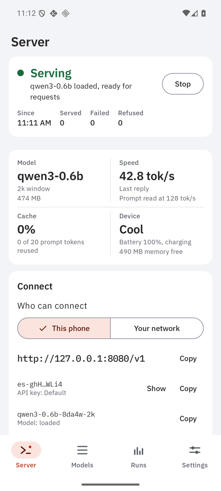
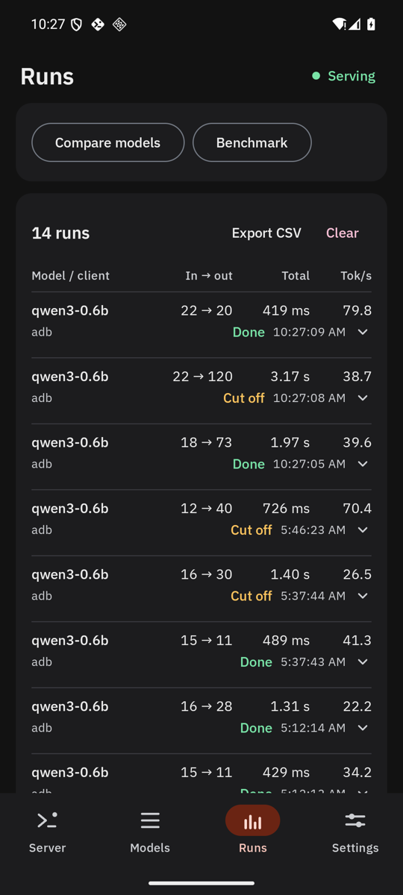
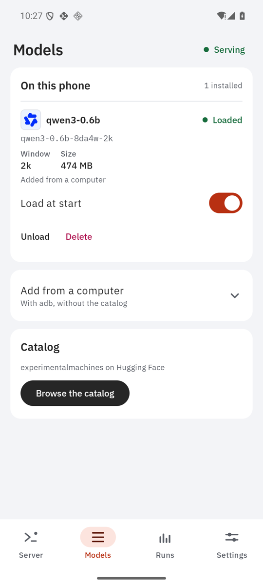

<p align="center">
  <picture>
    <source media="(prefers-color-scheme: dark)" srcset="docs/brand/lockup-dark.svg">
    
  </picture>
</p>

# ExecuServe

**ExecuTorch models, served from your phone.**

ExecuServe keeps a compiled [ExecuTorch](https://pytorch.org/executorch/) model loaded on an
Android phone and answers the OpenAI and Anthropic APIs over HTTP, in the background, for any
app on the phone or, if you allow it, on your network. The native console manages the server;
a lightweight browser chat lets you talk to its models from a phone, tablet, or computer.

<p align="center">
  
  
  
</p>

llama.cpp has `llama-server` for GGUF files. Nothing equivalent existed for `.pte` exports,
which on current phones are the fast path: on a Snapdragon 8 Elite the XNNPACK export
decodes 1.2 to 1.6 times faster than llama.cpp (measured in
[OpenWeights](https://github.com/ExperimentalMachines/openweights)). ExecuServe is built on
OpenWeights' ExecuTorch engine and its chat templates, which are tested byte for byte
against each model family's own.

Status: alpha. Every test tier passes, and the app serves real models on an Android 16
emulator and on a POCO X8 Pro Max (Dimensity 9500s): over Wi-Fi the OpenAI SDK suite passes
16 of 16, the Anthropic SDK suite 8 of 8 and the edge-case probe 28 of 28; a 10-minute
screen-off soak on battery answered 20 of 20; a warm second turn of a 2,000-token
conversation answers in 0.47 s instead of 8.4 s. Results:
[docs/results/2026-09-29-poco-x8-pro-max.md](docs/results/2026-09-29-poco-x8-pro-max.md).

## Quick start

You need an arm64 Android phone on Android 12 or later, `adb` on your computer, and an
ExecuTorch `.pte` export with its tokenizer (the app can also download one). Build and
install the app (see [Building](#building)), then:

```sh
tools/execuserve --model ~/models/Qwen3-1.7B-8da4w-gptq-2k.pte --port 8080
export OPENAI_BASE_URL=http://127.0.0.1:8080/v1 OPENAI_API_KEY=es-adb-…
```

```python
from openai import OpenAI
client = OpenAI()                     # reads the two variables above
reply = client.chat.completions.create(model="qwen3-1.7b",
                                        messages=[{"role": "user", "content": "Hello"}])
```

## Chat in your browser

Start a model, choose **Your network** in Settings, and open the **Browser chat**
address on another device on the same trusted network. On the phone itself, open
`http://127.0.0.1:8080/`. The chat uses the root address, without `/v1`.

Choose **Connect**, enter a key from Settings → API keys, then select a model. Replies
stream as they are generated, with a stop button, optional reasoning, and conversation
history within the tab. Layouts adapt to small screens, landscape, and desktop; light
and dark themes follow your system until you change them.

The client ships inside the server: no CDN, separate host, or browser inference runtime.
Inference runs on the phone. Keys and chats stay in browser memory and disappear on
reload; nothing is saved to browser storage. Network mode uses plain HTTP, so use a
trusted LAN or an authenticated HTTPS tunnel.

### Copy or scan connection details

The Hosting tab offers **Copy** and **Show QR** for each API URL, browser URL, API key,
and model ID. Settings → API keys offers the same actions. Copy confirms that the
exact value reached the **phone’s** clipboard; a remote-device viewer does not
necessarily forward that clipboard to your computer.

If the device refuses clipboard access, Copy opens the QR dialog automatically.
QR codes are generated locally. API-key QR codes require **Reveal QR code** and hide
after one minute or when backgrounded. They are visible to remote viewers and screen
capture: reveal only when ready to scan. The QR contains the actual key; hiding it does
not expire that key. Revoke it in Settings when needed. URL QR codes never embed keys.

### Host several models

In Settings → Hosting capacity, choose how many models to keep ready (one by default,
up to three), then load them from Hosting. Each model retains its own sequence cache.
This uses more RAM; pressure can reduce residency. Automatic CPU threads are required
for multiple resident models with the pinned ExecuTorch runtime.

Each model's **Connect** section provides a scoped API base and browser address:

- API: `http://<phone>:8080/models/<model-id>/v1`
- Browser: `http://<phone>:8080/models/<model-id>/`

Model IDs in paths are percent-encoded. Clients still send the model ID in their request.
The original `/v1` API and root browser page continue to support all installed models.
Scoped URLs share authentication, limits, and one compute queue; they are not separate
security boundaries. Models can stay loaded together, but inference executes one request
at a time. Independent parallel CPU execution would require a different runtime/process
architecture, with additional memory and scheduling costs.

Hosting shows separate prefill and decode measurements for each model. During prefill,
it shows elapsed time and prompt character progress; token rates are reported when the
runtime finishes measuring the request.

## Getting a model onto the phone

- **In the app:** Library → Browse the catalog lists the XNNPACK exports published under
  [huggingface.co/experimentalmachines](https://huggingface.co/experimentalmachines).
  Downloads resume after a drop, are pinned to one repository commit, and are checked
  against the publisher's SHA-256 before the model is offered.
- **From your computer:** `tools/execuserve --model path/to/Model.pte` pushes the file and
  the tokenizer exported with it, starts the server, forwards the port over adb and prints
  the base URL and key.
- **By hand:** `adb push Name.pte` and `Name.tokenizer.json` into
  `/sdcard/Android/data/org.experimentalmachines.execuserve/files/models/`. Push files
  into that folder, not folders: under Android 11+ storage a folder adb creates there
  belongs to the shell and the app cannot read it.

A `.pte` carries no tokenizer and no chat template, so both are named by the model's
family. Families with a template: Qwen3, Qwen3.5, Qwen2.5, Llama 3.2, SmolLM2, SmolLM3,
Phi-4-mini, Gemma 3, LFM2.5. Anything else is served on `/v1/completions` only.

## The host CLI

```
tools/execuserve --model qwen3-1.7b --port 8080      model already on the phone (id or alias)
tools/execuserve --model ~/Model.pte                  push it first
tools/execuserve --model qwen3-1.7b --network         reachable from the LAN too
tools/execuserve --model qwen3-1.7b --threads 4       CPU threads (0: ExecuTorch chooses)
tools/execuserve status | stop
tools/execuserve install app-release.apk             past ROMs that refuse `adb install`
tools/execuserve pull <hf-repo> <file.pte>            the phone downloads it, verified
tools/execuserve unrestrict                           Doze whitelist, appops, HyperOS autostart
  --serial <adb serial>   --key <secret>   --debug (the .debug build)   --no-forward
```

The CLI generates a key per device, stores it in `~/.config/execuserve/`, and hands it to
the app through an intent that only the adb shell may send: the service it starts is
guarded by `android.permission.DUMP`, which the shell holds and ordinary apps cannot get.

## API

OpenAI's and Anthropic's shapes, error codes and streaming framing, checked with the official
SDKs (`tools/compat/openai_sdk_check.py`, 16 checks; `tools/compat/anthropic_sdk_check.py`,
8 checks; both passing on the minified release build on the phone), with the codex CLI over
the Responses API, and with `tools/compat/edge_cases.py` (28 probes of what a careful server
should refuse, report or survive).

| Endpoint | |
|---|---|
| `POST /v1/chat/completions` | streaming, `stream_options.include_usage`, tools and tool calls, `reasoning_content`, opt-in `return_progress` |
| `POST /v1/responses` | string or item input, function-call items, typed stream events, `previous_response_id` with `store` |
| `POST /v1/messages` | Anthropic's Messages API: system, `tool_use` / `tool_result`, thinking blocks, its stream events, `cache_read_input_tokens`; `x-api-key` or bearer |
| `POST /v1/completions` | a raw prompt, no template |
| `GET /v1/models`, `/v1/models/{id}` | installed models, with `context_length`, `loaded`, `owned_by` (the lab) and `capabilities` |
| `POST /apply-template` | the exact prompt a chat request renders to, without running it (llama.cpp's name) |
| `GET /metrics` | Prometheus text: `execuserve_` counters, gauges, time-to-first-token and request quantiles |
| `GET /v1/execuserve/runs` | the caller's own run history as JSON with per-model summaries, or `?format=csv` |
| `GET /health` | no key needed |
| `GET /v1/execuserve/status` | what the lane is doing, the queue, resident models, threads, the caller's recent requests |
| `POST /v1/execuserve/models/{id}/load` · `/unload` | explicit residency |

- **Reasoning.** Qwen3 and SmolLM3 reason by default, as their templates do. Turn it off per
  request with `chat_template_kwargs: {"enable_thinking": false}`, `reasoning_effort:
  "none"` (Chat Completions) or `reasoning: {"effort": "minimal"}` (Responses), or for every
  request in Settings. Reasoning comes back as `reasoning_content`, or as a `reasoning`
  output item.
- **Honoured:** `max_tokens` / `max_completion_tokens` / `max_output_tokens`,
  `temperature`, `stop`, `tools` (function tools), `tool_choice` `auto` / `none`.
- **Accepted and ignored,** because the runtime's sampler has only a temperature: `top_p`,
  penalties, `seed`, `logit_bias`, `user`, and fields such as `include` (and `store` on
  Chat Completions, where OpenAI means keeping a copy for its evals). Each
  response names what it ignored in the `x-execuserve-ignored` header. Tools that are not
  function tools (hosted `web_search`, MCP `namespace` groups, custom tools) are dropped and
  named there too, so a client that offers them still works.
- **Refused with a 400 that names the parameter:** `n > 1`, `logprobs`, forced tool choice
  (`required`, a named function, Anthropic's `any` / `tool`), JSON-schema output, images and
  audio. Each needs the runtime to constrain or expose sampling, which ExecuTorch's LLM
  runner does not; faking it with a prefilled opener would promise what it cannot keep.
- **Stored responses.** `store` defaults to true, as on OpenAI: a response can be continued
  by `previous_response_id`. Stored in memory only, per key, at most 64 responses, 4 MiB and
  an hour; anything else (expired, another key's, from before a restart) is a 400
  `previous_response_not_found`, never a silent fresh start. `instructions` are not inherited.
- **Extensions:** `usage.prompt_tokens_details.cached_tokens` reports what the sequence
  cache saved; `timings` gives queue, load, prefill and decode figures in llama.cpp's
  vocabulary; with `return_progress: true` a stream sends `prompt_progress` chunks (in
  characters, which are exact, not estimated tokens) while a long prompt is read.

### Clients

Anything that takes an OpenAI base URL and key. For example:

- **OpenAI SDKs, LangChain, Vercel AI SDK:** `base_url` / `baseURL` plus the key.
- **Open WebUI:** Settings → Connections → OpenAI API, URL `http://<phone>:8080/v1`.
- **Another Android app on the same phone:** call `http://127.0.0.1:8080/v1`. Android
  refuses plain HTTP from apps targeting API 28+ unless the client app allows it, so add a
  network security config to that app:
  ```xml
  <network-security-config>
      <domain-config cleartextTrafficPermitted="true">
          <domain includeSubdomains="false">127.0.0.1</domain>
      </domain-config>
  </network-security-config>
  ```
  and point `android:networkSecurityConfig` at it. ExecuServe's own console does exactly this.
- **Anthropic SDKs and agents built on them:** `base_url` `http://<phone>:8080` (no `/v1`)
  and the key as `api_key`; it is sent as `x-api-key`.
- **codex CLI:** a provider with `wire_api = "responses"`:
  ```toml
  [model_providers.execuserve]
  name = "ExecuServe"
  base_url = "http://127.0.0.1:8080/v1"
  env_key = "EXECUSERVE_API_KEY"
  wire_api = "responses"
  ```
  Codex's instructions and tool schemas alone run to tens of thousands of tokens, more than
  a 2k or 8k phone export holds; such a request is refused with `context_length_exceeded`.

## How it behaves

- **One compute lane.** ExecuTorch's LLM runner holds one sequence and one KV cache per
  loaded model and cannot batch, and a phone CPU runs one sequence well, so requests queue
  for a single lane instead of running side by side and halving each other. The queue is
  bounded (16 waiting, 4 per client by default): a client over its share gets `429`, a full
  server `503`, both with a `Retry-After` the SDKs honour. Timeouts, cancellations and a
  client that disconnects, mid-stream or while its prompt is still being read, stop the
  runtime within one prompt chunk (under a second on the POCO).
- **The KV cache is the server's, not the client's.** Clients resend the conversation, as
  the OpenAI and Anthropic APIs expect; the server keeps the runtime's cache between requests
  and reuses it when the new prompt extends the old one exactly. It remembers the exact bytes
  the runtime holds for each reply it produced, so a follow-up or a tool loop sent back
  through an SDK still hits: a Qwen3 tool loop's second request reused 174 of 205 prompt
  tokens on the POCO. Reuse is per key: another key's request starts the cache over, so
  `cached_tokens` and the time to the first token never tell one client what another asked.
- **CPU threads.** ExecuTorch picks the performance cores minus one (7 on the POCO); the
  setting overrides it. That default is not the fastest at either phase there: 4 threads
  decoded 22 tokens a second against 18, 8 threads read prompts at 199 against 184.
- **Every run is kept:** the figures, never the prompt, the reply or a key, for the last
  10,000 runs or 30 days. The Runs tab compares models on like-for-like runs and flags a run
  whose own timings disagree; the benchmark measures a model the same way every time.
- **In the background.** A foreground service of type `specialUse` holds the server, with a
  partial wake lock and, on the network, a Wi-Fi lock. Under forced deep Doze with the
  screen off, the emulator served a request over its network in 119 ms, the platform
  reporting the Doze block active and the app allowed as a foreground service. OEM ROMs can
  do less: the console lists what to allow. On Xiaomi's HyperOS, Autostart also decides
  whether Android may restart the server after its process dies: with it off, a crash ended
  serving for good on the POCO; with it on, the server was back in two seconds. The app
  cannot read that setting, so it names it in Settings, and `tools/execuserve unrestrict`
  grants it over adb.
- **Heat and battery.** At thermal status `SEVERE` new requests get `503` with a retry
  time; at `CRITICAL` the running one is stopped. A battery floor can be set.

## The app

A console, not a chat, in PyTorch's colours (paper, ink and ember) and IBM Plex.

- **Server:** the state as a light and a word, naming the model a client gets and whether
  it is loaded, with the request being answered (cancel it there), the queue, totals since
  start, and a note when Android restarted it after a crash; anything that would stop it in
  the background; four figures (model, decode speed measured from the first token, cache
  reuse, heat, battery and free memory); **Connect**, with the one choice that matters (this
  phone or your network, applied at once), the addresses, the key, the exact model id to put
  in requests, **Share**, **Copy curl** (a request that runs as pasted, against that model)
  and **Copy env vars** (`OPENAI_BASE_URL` and `OPENAI_API_KEY`), and the config another app
  on the phone needs for plain HTTP to loopback; **Try it**, one prompt over HTTP like any
  client, streamed or whole, with the same request as `curl`; the latest runs.
- **Models:** what is installed, each with its lab's picture from Hugging Face and where it
  came from; downloads; the catalog.
- **Runs:** every request across restarts, each opening to its phases, device state and any
  disagreement between its own figures; a comparison of models on like-for-like runs; the
  benchmark; CSV export.
- **Settings:** connection, keys, model defaults, CPU threads, background behaviour,
  limits.

Light, dark or system theme, the same design at two brightnesses; every colour pair passes
WCAG AA and APCA (`tools/design/contrast.py`). The mark, the Block, is a chip package seen
from above with an ember die on its lid; `tools/design/mark.py` writes every copy of it,
from the launcher icon to the web chat, and the brand kit in [docs/brand](docs/brand).

## Security

Every request needs a key by default, loopback included, because any app with network
permission can reach `127.0.0.1`. Give each client its own key in Settings: the request log
shows which one asked, and a key can be revoked alone. Requests whose `Host` does not name
this phone are refused, which stops DNS rebinding from a web page in the phone's browser.
Network mode is plain HTTP: on a shared Wi-Fi the key can be read off the air. Across
networks, use Tailscale: its address works as is, and a MagicDNS name once added in Settings.

## Building

```sh
export JAVA_HOME=/opt/homebrew/opt/openjdk@21
./gradlew verify                       # every test tier, Android build, iOS compilation
./gradlew :android:app:assembleDebug   # the app
./gradlew :jvm:devserver:installDist   # the server on your laptop over a scripted model
jvm/devserver/build/install/execuserve-dev/bin/execuserve-dev --port 8080 --key sk-dev
uv run --with openai python tools/compat/openai_sdk_check.py http://127.0.0.1:8080/v1 sk-dev
```

Modules: `:shared:*` is Kotlin Multiplatform and compiles for Android, the JVM and iOS
(`api` the OpenAI wire format, `prompt` the chat templates, `engine` the scheduler and
cache, `catalog` model discovery, `server` the Ktor HTTP layer, `host` settings, lifecycle
and what each state means); `:android:*` is how Android lets it run. Why the line falls
where it does, the concurrency design and the edge cases are in
[docs/ARCHITECTURE.md](docs/ARCHITECTURE.md).

## Documentation

- [docs/ARCHITECTURE.md](docs/ARCHITECTURE.md): the design. The one compute lane, the KV
  cache and the reply ledger, backgrounding on Android, exposure and security, the HTTP API,
  every edge case and what happens, CPU threads, run history and metrics, how this compares
  with other servers, and the log of design reviews.
- [docs/TESTING-ON-A-PHONE.md](docs/TESTING-ON-A-PHONE.md): how to test on a physical phone,
  from installing past HyperOS to soaking it with the screen off.
- [docs/results/](docs/results/): what was measured on real phones, with dates.

## After this

The iOS app (the runtime binding over ExecuTorch's Apple frameworks and a shell; the rest
is shared), the other ExecuTorch backends (Vulkan, QNN, MediaTek) as further runtimes,
server-side tools, vision input for exports that carry an encoder, and TLS for network
mode.

Apache-2.0. By [Experimental Machines](https://experimentalmachines.org).
